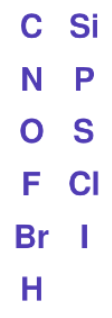

# Adding chemical equation with *OpenChemLib* chemical editor
The following instructions target users who are unfamiliar with _OpenChemLib_ chemical editor. Feel free to check the Help  in the editor first for detailed explanations.

> For those who just need a Copy & Paste:  
>  then  (left: reactant; right: product): across **different** entries. 
> : **within the same** editor 
> Or use the Lasso Pointer Tool  to select the target molecule, hold 'Shift' and drag the molecule to create a copy  

## Video 1 (Sandmeyer Reaction): Simple molecules
<video id="sandmeyer" controls muted width="100%" poster="../assets/videos/thumbnail_chemicaleditor_sandmeyer.png">
  <source src="../assets/videos/chemicaleditor.mp4" type="video/mp4">
</video>

## Explanation of tools
[]: #

|Button|Function|Explanation|
|---|---|---|
||*Copy RXN V3000 to clipboard*|Copy the chemical equation that can be pasted directly in ChemDraw or ChemSketch|
| (Left)|*Add reactants from clipboard (RXN, SMILES or ID Code)*|Paste reactants copied with  or from e.g. ChemDraw (Copy as SMILES recommemded) can be pasted here|
| (Right)|*Add product from clipboard (RXN, SMILES or ID Code)*|Paste product copied with  or from e.g. ChemDraw (Copy as SMILES recommemded) can be pasted here
||*Help*|Detailed explanations of the chemical editor|
||*Copy product or reagent as molfile*|Copy any molecule in the editor as molfile, can be pasted in e.g. Chemdraw|
||*Copy reagent*|Copy and paste any molecule directly within the same editor|
||*Show fullscreen*|Open editor in fullscreen mode (press Esc to exit)|
||*Clear Page*|Clear all elements in the editor|
||*Undo*|Undo last action|
||*Cleanup button*|Clean up the equation or only the selected molecule|
||*Zoom and Rotate Tool*||
||*Lasso Pointer Tool*|Use by:  1. Dragging the cursor around atoms of choice;   2. Double clicking any atom or bond in a molecule;   3. pressing and holding 'alt' for retangle selection;     Single selection within one molecule is also allowed. Selected atoms or fragment can be dragged and moved across the editor. Reactants are labeled with alphabets and placed on the left of the reaction arrow; products are labeled with 'P1', 'P2' etc. and placed on the right side.     To unselect click any empty area in the editor     To create a copy select the target molecule, then drag the selected fragment while pressing and holding 'Shift'. |
||*Mapping Tool*||
||*Unknown Configuration Tool*|Label unknown stereo configuration at a chiral centre|
|      |*ESR (enhanced stereo recognition) Tools*|Click multiple times to select different modes.    Absolute configuration or belongs to a group of stereo centers that have the drawn, but relative configuration.    Both the drawn and inverse configurations of the relative stereo centres are present.    Either the drawn or the inverse configuration is present.   The indicator group numbers show which stereo centers belong to the same group.|
||*Delete Tool*|Delete a single atom or a bond. Alternatively press 'Delete' while pointing at the target atom or bond|
||*Text Tool*||
||*Bond Tools*|Click onto an atom or anywhere in the editor to create C-C single bond, click the created bond multiple times for different bond orders: double bond, cross bond (unknown configuration) and triple bond.    Chain Tool: a handy tool for long carbon chains    Stereo bonds|
||*Ring Tools*|Available from 3 members ring to 7 members ring and benzene Ring. Create polycyclic structures by adding rings at an atom or at a bond|
||*Charge Tool*|Amend the charge of the atom by 1. Alternatively press '-' or '+' while pointing at the target atom.|
||*Atom Tool*|Select the tool and click anywhere in the editor to add the atom. Alternatively type the chemical symbol on keyboard (case insensitive) while pointing at the target atom.|
||*Atom Detail Tool*|Upon selection of the tool a dialogue window would be opened. Atom label may be specified with different conditions (e.g. radical state). While the tool is still selected the customized conditions can be further applied by clicking the target atoms directly.|

## Tips and Tricks

### Type the chemical symbol directly to change the atom.
[Jump to ](#) <a href="javascript:void(0)" onclick="seekVideo(68)">▶ 01:08</a>
