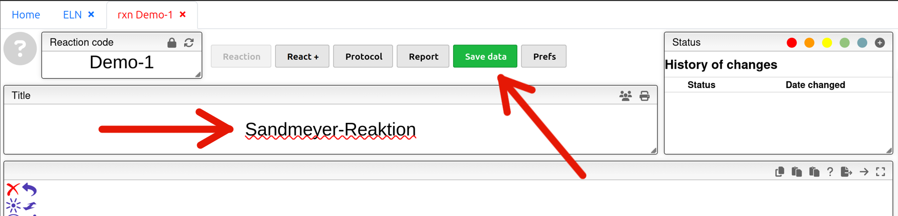
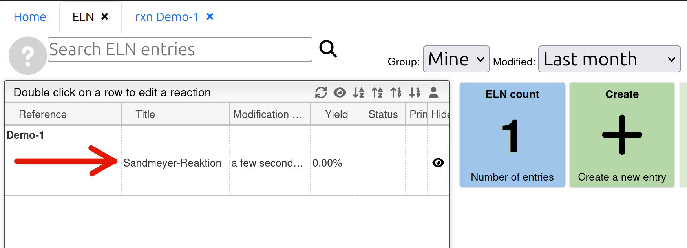

# How to start

## 1.  Open your ELN Entry

<video autoplay muted loop playsinline width="60%" alt="screen recording of opening an ELN entry">
	<source src="../assets/videos/how-to-start-1.mp4" type="video/mp4">
</video>

Click  to open the ELN tab. Click  and customize a reaction code to create a new entry. Beware that once entry is created it cannot be deleted and the reaction code cannot be modified. To hide the unwanted entries on the overview of ELN simply click  in `Hide` column on the right. 

## 2.  Customize name of entry in 'Title'

On the page of the ELN entry enter a title of your choice for the reaction and click . From now on your entry would be automatically saved regularly. But it is still strongly recommended to save manually after each ammendment!

## 3.  Add your reaction and reagents
### Method 1 (recommended): First data entry then chemical equation
> It saves your time from drawing chemical structures.

<video controls muted width="60%">
	<source src="../assets/videos/how-to-start-3-4.mp4" type="video/mp4">
</video>

1. The `code` column itself has search function embedded. 
    1. Search with (the first few characters of) the trivial name (e.g. with 'anthran' or in full 'anthranilic acid')
    2. Search with the chemical formula (e.g. with 'KI', 'HCl').
    3. Look up the CAS number either on [GESTIS](https://gestis.dguv.de/search) (in German) or on [CAS Sci Finder](https://scifinder-n.cas.org/) (in English, login with *name@uni-jena.de* required) and paste it into the cell. Then hit 'Enter' on keyboard.
3. In the pop-up window click the chemical of choice once to select. Usually the fields in `Name`, `mf` (molecular formula), `mw` (molecular weight) and `density` are automatically filled up. Nevertheless for some molecules, of which relatively little literature are currently available, manual input might be required.
4. Click the <svg style="margin: 0; background-color: b8b8b8; width: 1.5em; height: 1.5em; vertical-align: top;" viewBox="0 0 300 300" xmlns="http://www.w3.org/2000/svg"><polygon points="150,10 280,85 280,215 150,290 20,215 20,85" fill="none" stroke="#000" stroke-width="10" stroke-linejoin="round"/></svg> to add the molecules into your chemical editor. Use the Lasso Pointer Tool  in the toolbar (lasso as shown in video or hold 'Alt' and drag for retangular selection or double click a bond or an atom of the molecule) to rearrange the components in the chemical equation. Products stand on the right of the reaction arrow and are labeled with a e.g. 'P1' watermark.
5. Use the Cleanup Button  to clean up the equation. 

### Method 2: First chemical equation then data entry
[Click here](chemicaleditor.md) for more information about the *OpenChemLib* chemical editor.

> For those who are just looking for a Copy & Paste:  
>  then  (left: reactant; right: product): across **different** entries. 
> : **within the same** editor 
> Or use the Lasso Pointer Tool  to select the target molecule, hold 'Shift' and drag the molecule to create a copy  

1. Draw each chemical structure you need inside the chemical editor, or paste your chemical equation from e.g. ChemDraw or ChemSketch (if nothing happens, try "copy as SMILES" :) )
2. Repeat Step 1 to 5 except 4 in [Method 1](how-to-start.md#method-1-recommended-first-data-entry-then-chemical-equation)

## 4. Calculation of the amounts of reagents required (*Ansatztberechnung*)
> *The following instructions are only based on OC2-Praktikum.*

<video controls muted width="60%">
	<source src="../assets/videos/how-to-start-5.mp4" type="video/mp4">
</video>

  1. Enter the required amount of `mmoles` or `ml` or `g` of the reactants according to your script (*Versuchsanleitung*) and press 'Enter' to confirm. Cells in `g`, `ml`, `mmoles` and `equiv` would be automatically updated. If not, usually it is due to missing information of density or the material is in solid under standard condition. Sometimes manual input might be required. Left click for the next cell for next entry.
> Instead of left clicking the next cell, press 'Enter', then 'Tab' or 'Shift'+'Tab' to activate next cell for entry.

2. Make sure your have the “Linked” checkbox on the right side checked. 
> The 'Theoretical yield' of produtcs on the right is calculated based on the starting materials with 1 equiv.
3. Fill in the desired yielding of your product (e.g. in `g` 10 for liquid or 5 for solid compounds). The amount of reactants required would then be automatically updated.
> To delete and redo entries in `g`, `ml` and `mmoles` press 'Delete' inside the cell in `equiv`.

## 5. GHS Pictogramms, H- and P-statements 
*this feature in scipeaks demo ver is different, do I need to add my SciFinder token for the full version?*

1. Visit [GESTIS](https://gestis.dguv.de/search) (in German) or [CAS Sci Finder](https://scifinder-n.cas.org/) to look up information of hazards of the chemicals. 
2. Inside the `Hazard Pictograms` column type the GHS number respectively (e.g. '6' for GHS 6 pictogram)

> Feature in development: Automatic generation of GHS pictograms with <svg style="margin: 0; vertical-align: middle;" width="30" height="30" viewBox="0 0 680 600" xmlns="http://www.w3.org/2000/svg"><polygon points="340,60 560,480 120,480" fill="none" stroke="#222" stroke-width="20" stroke-linejoin="round"/><rect x="327" y="200" width="26" height="150" rx="6" fill="#222"/><circle cx="340" cy="410" r="18" fill="#222"/></svg> and browsing of H- and P-Statements with i 

## 6. Change status of the entry

> Now your ELN is ready to use!

Next: [Scheme-Steps of the synthesis](scheme.md)
