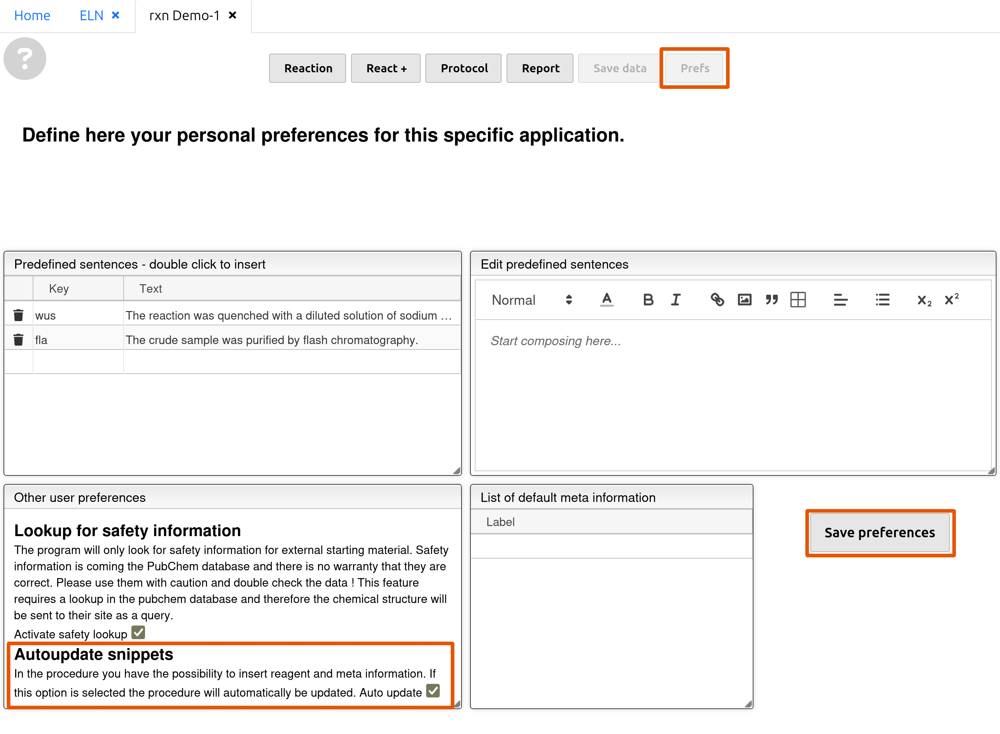

# Scheme: describing your steps in your experiment

> Before you lose your patience, please just allow us to show you the following feature:
> <video autoplay loop muted playinline width="100%" alt="demonstration of snippet insertion"> <source src="../assets/videos/scheme-1.mp4" type="video/mp4"></video>
> cool, right?

*German translation of reagents in development*

## Configuration of shortcut keys (snippets)

Go to 'Prefs' and check the box in 'Autoupdate snippets'. Click 'Save preferences'.

Stay on this page. Here we do all the configuration.

## Video: thorough walkthrough

<video muted controls width="100%">
  <source src="../assets/videos/scheme-preset.mp4" type="video/mp4">
</video>

### Predefined sentences
1. Customize and add your own key inside the box 'Predefined sentences' on the left. Beware: **umlauts (ä, ö, ü) are not applicable!**
2. Enter / Edit your predefined sentence on the right **without** the keys (e.g. `r1`). Placeholders (e.g. '[ ]' in the clip) for them are nevertheless recommended. 
> Note: keys like `r1` or `_temp1` do not work inside a predefined sentence. Unlike in the main text, placeholders inside a predefined sentence will not be replaced with your customized values/text.
3. The predefined sentence is now shown on the left. To use it simply type your customized key inside the main text box in 'Reaction' then hit 'Space'/'Tab'/'Enter'.

### Meta information `_metainfo`
This is meant for storing information of reaction conditions such as temperature and reaction time. Any other sorts of customization is also possible.

1. Click  on the right and customize your own key *in lower case*.
2. Enter your customized value or text inside the slot on the right of the key. Don't forget your unit (e.g. °C)!
3. To use your key from Meta information: type `_` and your key then hit 'Space'/'Tab'/'Enter' inside the main text box.

### Test your configuration and the automatic input of Reagents `r`
1. Return to 'Reaction' and scroll to the main text box. On the right side of the main text box you may see the previously configured predefined sentences and meta information. 
2. Inside the text box simply type your customized key of your predefined sentence(s), type `_` and your key of the meta information configured then hit 'Space'/'Tab'/'Enter'. For reagents type `r` and the corresponding ID (`1`, `2`, ....) as listed above and hit 'Space' / 'Tab' / 'Enter'.
> After the insertion of the snippet (predef. sentences/meta info./reagent) a space is automatically inserted *after the character*, where you hit your key for insertion. To avoid that simply insert one space before the next character.
><video autoplay loop muted width="100%"> <source src="../assets/videos/scheme-2.mp4" type="video/mp4"> </video>
3. To amend the predefined sentences, go back to 'Prefs'; to amend meta information, change the values/text directly on the right; reagents ID cannot be modified.
